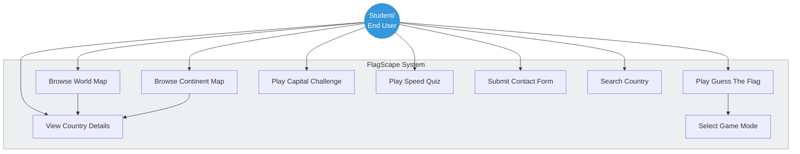
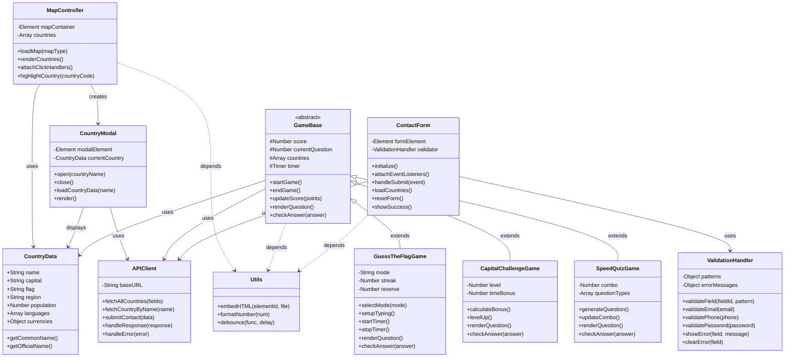
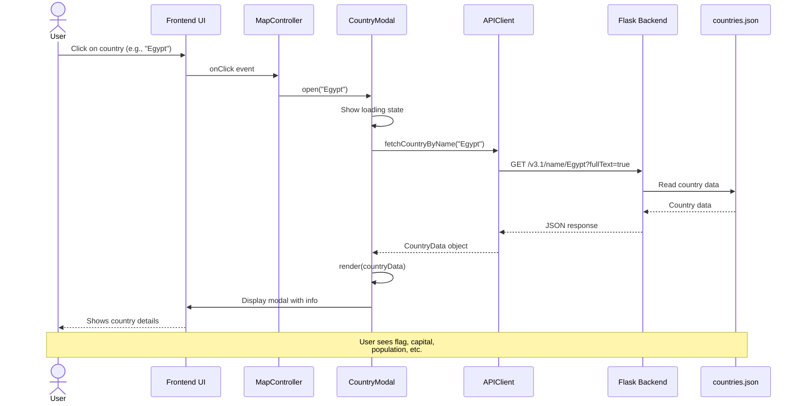
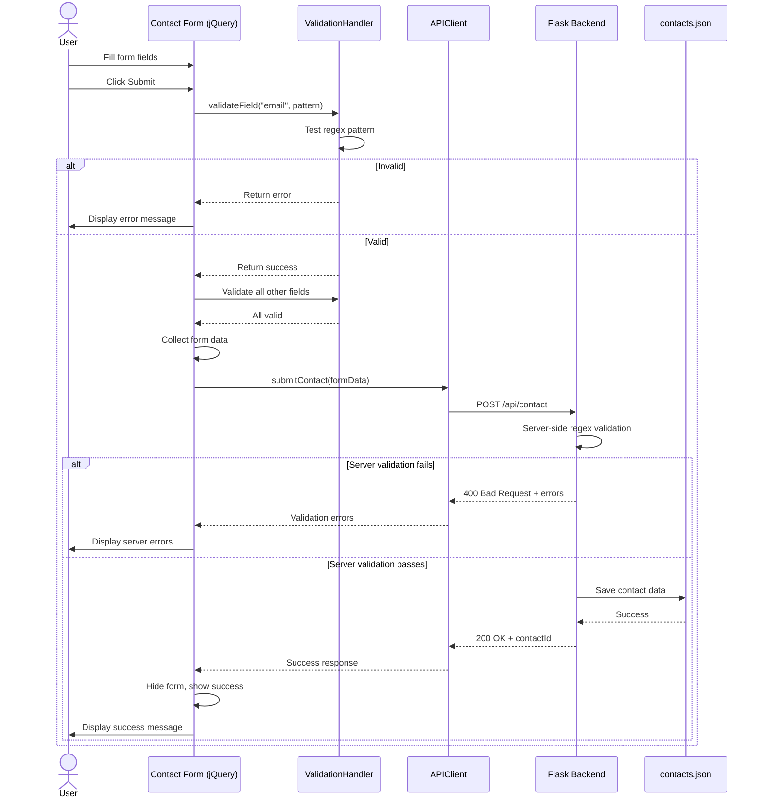
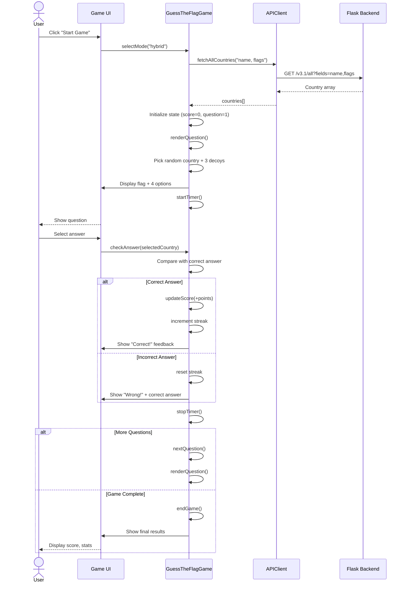
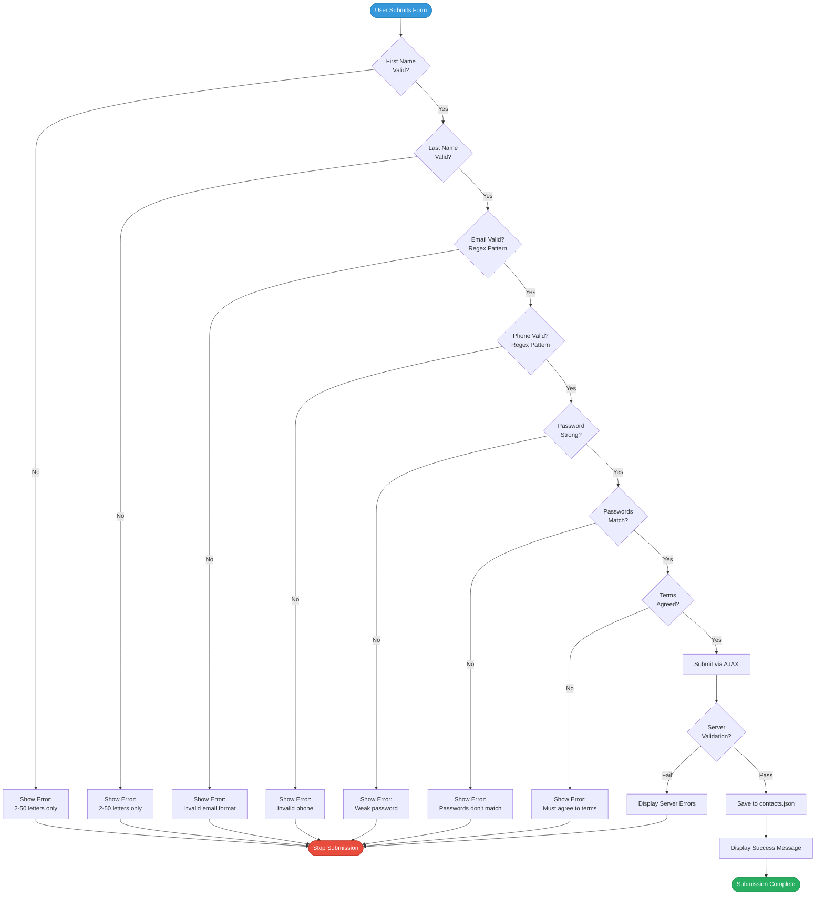
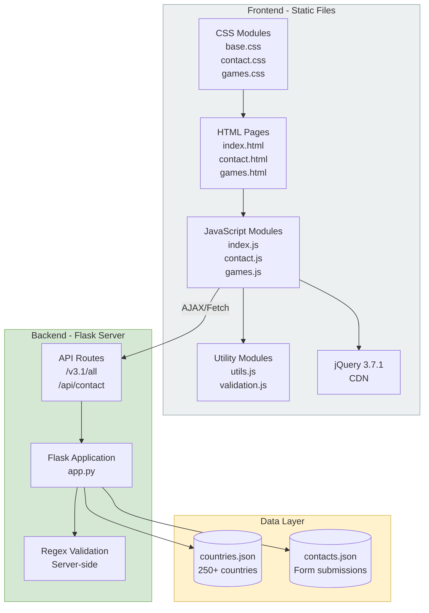
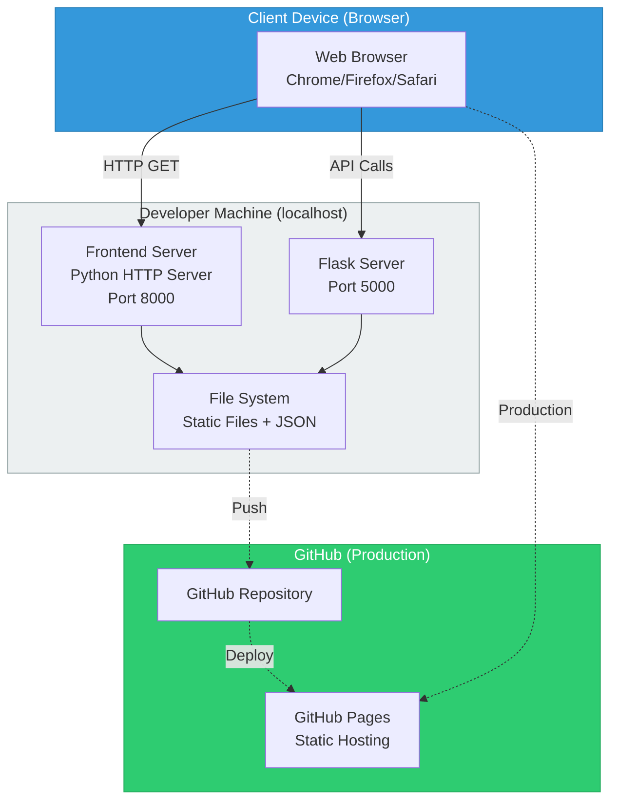
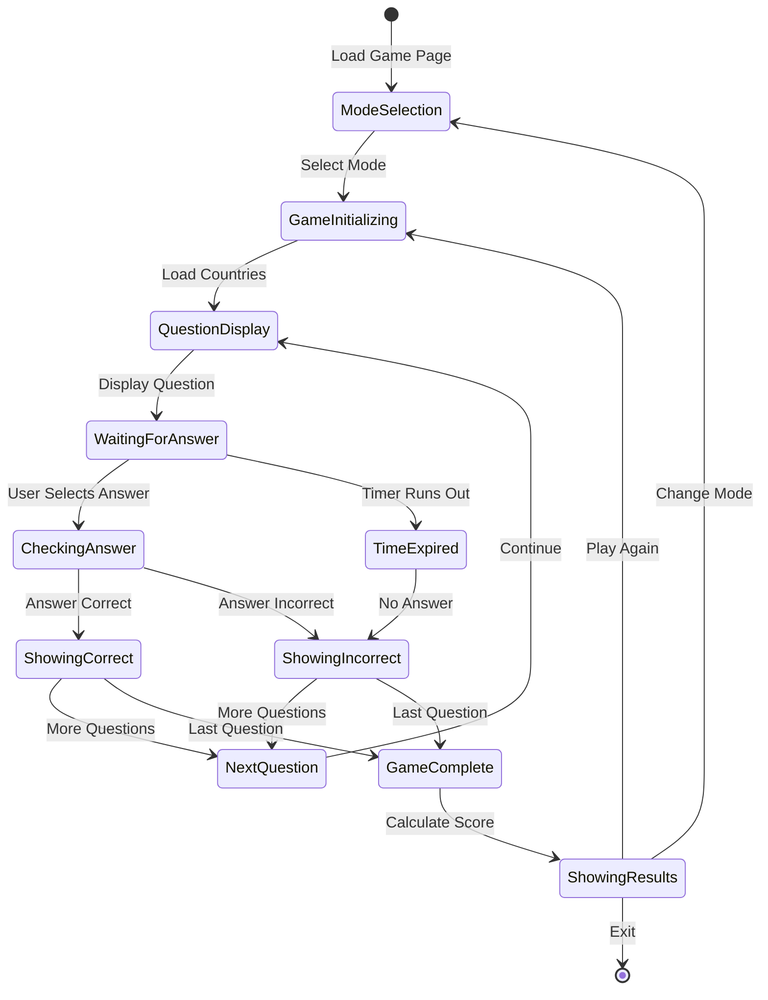

# FlagScape UML Diagrams

This document contains comprehensive UML diagrams for the FlagScape project, demonstrating the system design and architecture.

---

## 1. Use Case Diagram

The use case diagram shows the interactions between users and the FlagScape system.

### Use Case Descriptions

**UC1: Browse World Map**
- **Actor**: Student/End User
- **Description**: User views interactive world map and can click on countries
- **Precondition**: Application loaded
- **Postcondition**: Map displayed with clickable countries

**UC2: Browse Continent Map**
- **Actor**: Student/End User
- **Description**: User selects a specific continent to view
- **Precondition**: Navigation menu accessible
- **Postcondition**: Continent-specific map displayed

**UC3: View Country Details**
- **Actor**: Student/End User
- **Description**: User clicks on a country to see detailed information
- **Precondition**: Map loaded, country clickable
- **Postcondition**: Modal or details page shows country information

**UC4: Play Guess The Flag**
- **Actor**: Student/End User
- **Description**: User plays flag identification game
- **Precondition**: Game page loaded
- **Postcondition**: User sees final score and results

**UC5: Play Capital Challenge**
- **Actor**: Student/End User
- **Description**: User matches capitals to countries
- **Precondition**: Game page loaded
- **Postcondition**: User completes quiz and sees results

**UC6: Play Speed Quiz**
- **Actor**: Student/End User
- **Description**: User answers mixed geography questions rapidly
- **Precondition**: Game page loaded
- **Postcondition**: User sees performance statistics

**UC7: Submit Contact Form**
- **Actor**: Student/End User
- **Description**: User fills out and submits contact information
- **Precondition**: Contact page loaded
- **Postcondition**: Form validated and submitted, confirmation displayed

**UC8: Search Country**
- **Actor**: Student/End User
- **Description**: User searches for specific country information
- **Precondition**: Search functionality available
- **Postcondition**: Matching countries displayed

**UC9: Select Game Mode**
- **Actor**: Student/End User
- **Description**: User chooses difficulty/type of game
- **Precondition**: Game loaded
- **Postcondition**: Selected mode starts

---

## 2. Class Diagram

The class diagram represents the JavaScript module structure and data models.

### Class Descriptions

**CountryData**: Represents a country with all its attributes (flag, name, capital, etc.)

**MapController**: Manages SVG map rendering and user interactions

**CountryModal**: Handles popup display of country information

**GameBase**: Abstract base for all game types with common functionality

**GuessTheFlagGame**: Flag identification game with multiple modes

**CapitalChallengeGame**: Capital city matching game

**SpeedQuizGame**: Rapid mixed geography questions

**ValidationHandler**: Client-side form validation using regex

**ContactForm**: Manages contact form submission with jQuery

**APIClient**: Handles all API communications to Flask backend

**Utils**: Utility functions shared across modules

---

## 3. Sequence Diagram - View Country Details

This sequence diagram shows the flow when a user clicks on a country to view its details.

---

## 4. Sequence Diagram - Contact Form Submission

This sequence diagram illustrates the form submission process with validation.

---

## 5. Sequence Diagram - Game Flow (Guess The Flag)

This diagram shows the game initialization and question flow.

---

## 6. Activity Diagram - Form Validation Process

This activity diagram shows the validation workflow for the contact form.

---

## 7. Component Diagram

The component diagram shows how different modules interact in the system.

---

## 8. Deployment Diagram

Shows how the application is deployed and accessed.

---

## 9. State Diagram - Game State Machine

Shows the different states in a game session.

---

**Document Version**: 1.0  
**Date**: December 27, 2025  
**Authors**: 3mk Amr, 3mk Hekal  
**Course**: Network and Web Programming (CNC111)  
**Institution**: E-JUST University  

**Note**: All diagrams use Mermaid syntax for rendering in Markdown viewers that support it.
